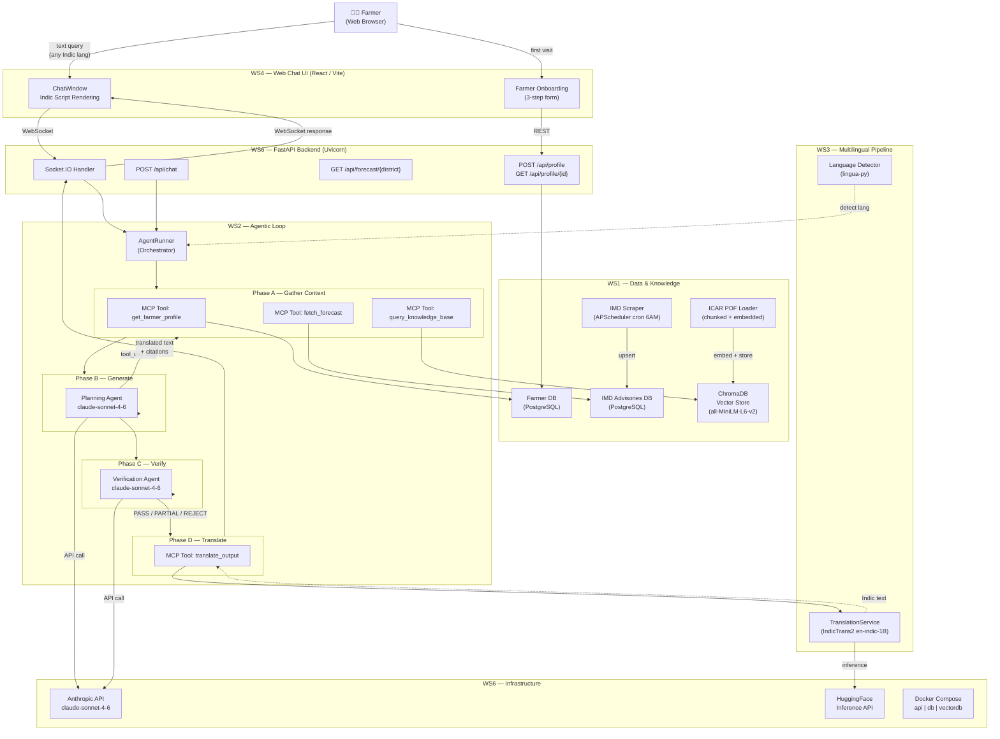
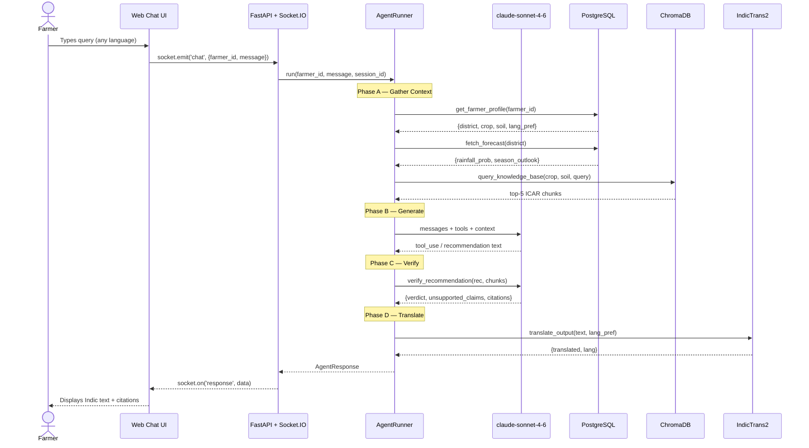
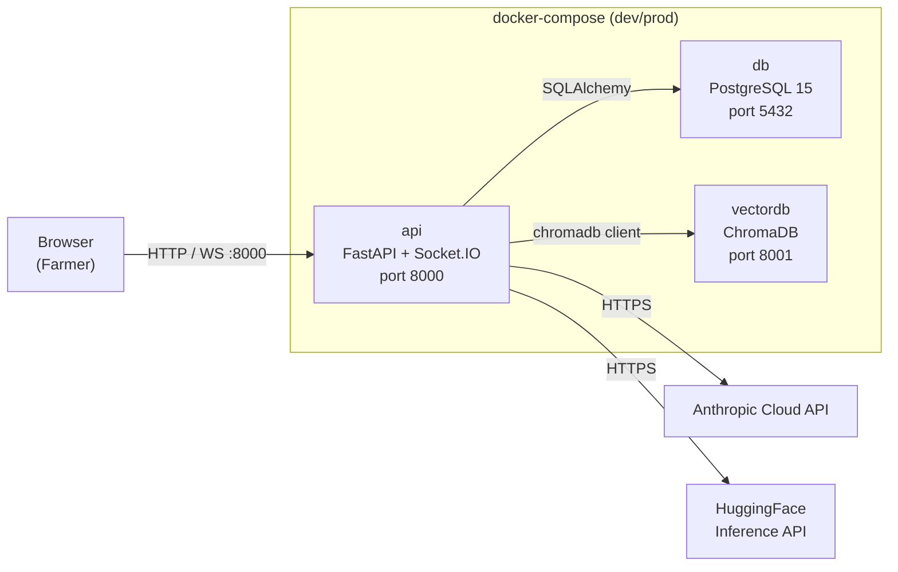

# CropCompass — System Architecture

## Component Architecture

```mermaid
graph TD
    Farmer["🧑‍🌾 Farmer\n(Web Browser)"]

    subgraph UI["WS4 — Web Chat UI (React / Vite)"]
        ChatWindow["ChatWindow\nIndic Script Rendering"]
        Onboarding["Farmer Onboarding\n(3-step form)"]
    end

    subgraph API["WS6 — FastAPI Backend (Uvicorn)"]
        ChatRoute["POST /api/chat"]
        ProfileRoute["POST /api/profile\nGET /api/profile/{id}"]
        ForecastRoute["GET /api/forecast/{district}"]
        SocketIO["Socket.IO Handler"]
    end

    subgraph AgentLoop["WS2 — Agentic Loop"]
        AgentRunner["AgentRunner\n(Orchestrator)"]

        subgraph PhaseA["Phase A — Gather Context"]
            T1["MCP Tool: get_farmer_profile"]
            T2["MCP Tool: fetch_forecast"]
            T3["MCP Tool: query_knowledge_base"]
        end

        subgraph PhaseB["Phase B — Generate"]
            Planner["Planning Agent\nclaude-sonnet-4-6"]
        end

        subgraph PhaseC["Phase C — Verify"]
            Verifier["Verification Agent\nclaude-sonnet-4-6"]
        end

        subgraph PhaseD["Phase D — Translate"]
            T4["MCP Tool: translate_output"]
        end
    end

    subgraph DataLayer["WS1 — Data & Knowledge"]
        IMDPipeline["IMD Scraper\n(APScheduler cron 6AM)"]
        IcarLoader["ICAR PDF Loader\n(chunked + embedded)"]
        FarmerDB["Farmer DB\n(PostgreSQL)"]
        AdvisoryDB["IMD Advisories DB\n(PostgreSQL)"]
        VectorStore["ChromaDB\nVector Store\n(all-MiniLM-L6-v2)"]
    end

    subgraph MLLayer["WS3 — Multilingual Pipeline"]
        LangDetect["Language Detector\n(lingua-py)"]
        Translator["TranslationService\n(IndicTrans2 en-indic-1B)"]
    end

    subgraph Infra["WS6 — Infrastructure"]
        Anthropic["Anthropic API\nclaude-sonnet-4-6"]
        HFInference["HuggingFace\nInference API"]
        Docker["Docker Compose\napi | db | vectordb"]
    end

    %% User → UI → API
    Farmer -->|"text query\n(any Indic lang)"| ChatWindow
    Farmer -->|"first visit"| Onboarding
    ChatWindow -->|"WebSocket"| SocketIO
    Onboarding -->|"REST"| ProfileRoute

    %% API → Agent
    SocketIO --> AgentRunner
    ChatRoute --> AgentRunner

    %% Agent phases
    AgentRunner --> PhaseA
    T1 --> FarmerDB
    T2 --> AdvisoryDB
    T3 --> VectorStore
    PhaseA --> PhaseB
    PhaseB --> Planner
    Planner -->|"tool_use loop"| PhaseA
    Planner --> PhaseC
    PhaseC --> Verifier
    Verifier -->|"PASS / PARTIAL / REJECT"| PhaseD
    T4 --> Translator

    %% Data ingestion
    IMDPipeline -->|"upsert"| AdvisoryDB
    IcarLoader -->|"embed + store"| VectorStore

    %% Profile CRUD
    ProfileRoute --> FarmerDB

    %% ML layer
    LangDetect -.->|"detect lang"| AgentRunner
    Translator -.->|"Indic text"| T4

    %% External services
    Planner -->|"API call"| Anthropic
    Verifier -->|"API call"| Anthropic
    Translator -->|"inference"| HFInference

    %% Response back to user
    PhaseD -->|"translated text\n+ citations"| SocketIO
    SocketIO -->|"WebSocket response"| ChatWindow
```

---

## Request / Response Flow

```mermaid
sequenceDiagram
    actor Farmer
    participant UI as Web Chat UI
    participant API as FastAPI + Socket.IO
    participant Agent as AgentRunner
    participant LLM as claude-sonnet-4-6
    participant DB as PostgreSQL
    participant RAG as ChromaDB
    participant Trans as IndicTrans2

    Farmer->>UI: Types query (any language)
    UI->>API: socket.emit('chat', {farmer_id, message})

    API->>Agent: run(farmer_id, message, session_id)

    Note over Agent: Phase A — Gather Context
    Agent->>DB: get_farmer_profile(farmer_id)
    DB-->>Agent: {district, crop, soil, lang_pref}
    Agent->>DB: fetch_forecast(district)
    DB-->>Agent: {rainfall_prob, season_outlook}
    Agent->>RAG: query_knowledge_base(crop, soil, query)
    RAG-->>Agent: top-5 ICAR chunks

    Note over Agent: Phase B — Generate
    Agent->>LLM: messages + tools + context
    LLM-->>Agent: tool_use / recommendation text

    Note over Agent: Phase C — Verify
    Agent->>LLM: verify_recommendation(rec, chunks)
    LLM-->>Agent: {verdict, unsupported_claims, citations}

    Note over Agent: Phase D — Translate
    Agent->>Trans: translate_output(text, lang_pref)
    Trans-->>Agent: {translated, lang}

    Agent-->>API: AgentResponse
    API-->>UI: socket.on('response', data)
    UI-->>Farmer: Displays Indic text + citations
```

---

## Deployment Topology

```mermaid
graph LR
    subgraph DockerCompose["docker-compose (dev/prod)"]
        api["api\nFastAPI + Socket.IO\nport 8000"]
        db["db\nPostgreSQL 15\nport 5432"]
        vectordb["vectordb\nChromaDB\nport 8001"]
    end

    Browser["Browser\n(Farmer)"] -->|"HTTP / WS :8000"| api
    api -->|"SQLAlchemy"| db
    api -->|"chromadb client"| vectordb
    api -->|"HTTPS"| AnthropicCloud["Anthropic Cloud API"]
    api -->|"HTTPS"| HFCloud["HuggingFace\nInference API"]
```
